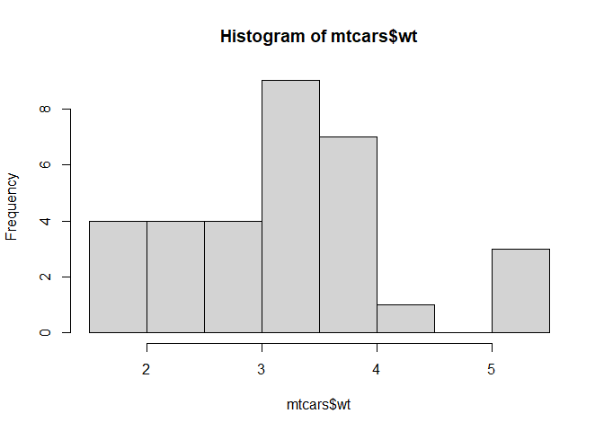
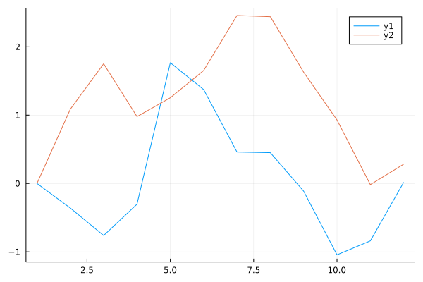
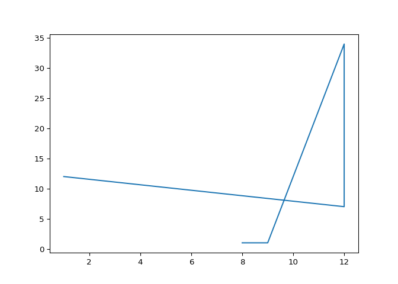

cap1
================

``` r
library(reticulate)
library(JuliaCall)
knitr::opts_chunk$set(
  warning = F
  , message = F
)
knitr::knit_engines$set(julia = JuliaCall::eng_juliacall)
```

# Primer titulo

## Resultados

=== R

``` r
hist(mtcars$wt)
```

<!-- -->

=== Julia

``` julia
using Plots
plot(Plots.fakedata(12, 2))
```

<!-- -->

=== Python

``` python
import matplotlib.pyplot as plt
x = [1, 12, 12, 9, 8]
y = [12, 7, 34, 1, 1]
plt.plot(x, y)
plt.show()
```

<!-- -->

=== “C”

    ``` c
    #include <stdio.h>

    int main(void) {
      printf("Hello world!\n");
      return 0;
    }
    ```

=== “C++”

    ``` c++
    #include <iostream>

    int main(void) {
      std::cout << "Hello world!" << std::endl;
      return 0;
    }
    ```
